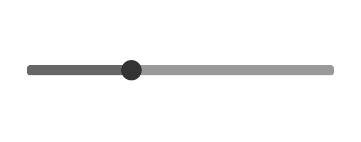

# Control

Remaking standard web controls using the standard HTML elements and VueJS to improve flexibility.

# Technical Details

Controls are VueJS components.

# Range Slider (ctrl-slider)

The range slider contains three `div` elements. The `ctrl-slider` is the background rect for the control. The `ctrl-marker` is the knob that the user can drag. The `ctrl-highlight` is the highlighted portion of the slider to the left of the marker.

# Modifying the State of a Control

`app.$children[0].value = 100;`

or

`app.$children[<control_index>].<state_name> = <value>;`

# Image

# View Live Demo

[View Live Demo](#)

# Todo

- [x] Bug: value to pixel conversion does not take into account the CSS width of a slider.
- [x] Click event on slider should move marker to location.
- [x] Ability to slide the control
- [x] Bug: lifting mouse on `marker` counts a click and causes marker to return to almost the start of the `slider`

- [ ] Make a way to pass a control name from HTML through to state object. Example: If control is named `sam` then `this.sam.<state>` is bound to Vue state

- [ ] Round value to step in computed `position` property

# end
